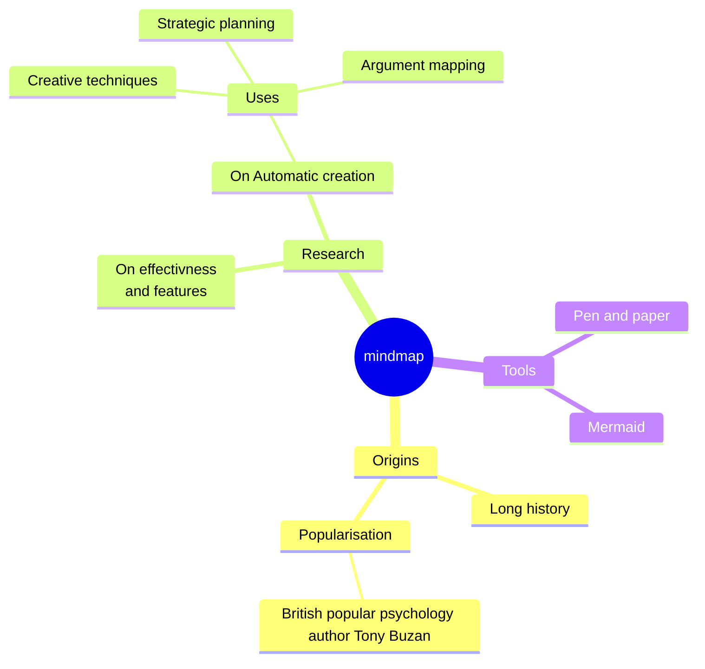

前端课程

<!--more-->

	1.网页的三要素：
		HTML：网页的结构
		CSS：网页的样式
		JavaScript:网页的行为
	2.网页的基本结构:
	
	3.网页的元素：开始标签 + 内容 + 结束标签 
	注：单标签；没有内容，没有结束
	
	head元素是title元素的父元素。
	title是head的子元素
	
	4.属性：key="value" 是写在开始标签内


## HTML介绍

HyperText Marked Language，HTML 是一种标记语言，使用一套标记标签来描述网页，Web浏览器（如谷歌浏览器，Internet Explorer，Firefox，Safari）是用于读取HTML文件，并将其作为网页显示，标记标签也可以称为元素，不同的标签有不同的功能解释，用来表示不同的功能。HTML由 W3C制定的，W3C(World Wide Web Consortium)是一个非盈利性组织。

标签特点：

- HTML 标签是由尖括号包围的关键词
- 标签通常是成对出现的。标签对中的第一个标签是开始标签，第二个标签是结束标签。
- 标签不区分大小写， html5规定必须小写


## 内联元素和块级元素

### 基本标签


```php+HTML
<!--声明html文件-->
<!DOCTYPE html>
<!--用于声明当前网站是英文网站还是中文网站-->
<html lang="en">
<!--头部标签，一些头部信息以及文档的一些相关配置信息-->
<head>
<!--   告诉浏览器，当前文本的字符编码都是utf-8 -->
    <meta charset="UTF-8">
<!--    定义文档标题-->
    <title>前端开班典礼</title>
</head>
<!--可视化区域-->
<body>

</body>
</html>
```


### 块级标签

#### 段落标签

```
<p>这是段落标签</p>
```

#### 列表标签

```
有序列表：<ol></ol>
无序列表：<ul></ul>
定义列表：
<dl>
    <dt></dt> 
    <dd></dd>
</dl>

```

#### 盒子

```
盒子（需要定义宽高）,没有语义 是进行网页布局的。
<div></div>
```

#### 标题标签

```
标题标签从大到小显示有h1-h6

<h1>这是h1标题标签</h1>
```


```html
<!DOCTYPE html>
<html lang="en">
<head>
    <meta charset="UTF-8">
    <title>Title</title>
</head>
<body>
<!--段落标签-->
<p>段落标签就是p标签</p>
<p>段落标签就是p标签</p>

<!--列表标签-->
<!--有序列表 ol  start 从第几个开始  type 排序类型-->
<ol type="a">
<!--    li 列项-->
    <li>第一点</li>
    <li>第二点</li>
</ol>

<!--无序列表 ul-->
<ul>
    <li>第三点</li>
    <li>第四点</li>
</ul>

<!--定义列表 dl-->
<dl>
<!--    dt 列表项-->
    <dt>白富美</dt>
<!--    dd 对列表项的具体解释或者秒速-->
    <dd>很白</dd>
    <dd>很有钱</dd>
    <dd>很好看</dd>
</dl>

<!--盒子 div 需要定义宽高-->
<div style="border:1px solid red">盒子</div>

<!--标题标签 h1-h6-->
<h1>一级标题</h1>
<h2>2级标题</h2>
<h6>6级标题</h6>
</body>
</html>
```

运行结果为：


### 内联标签

#### 超链接标签

```
<a></a>
用于跳转链接页面
```

#### 图片标签

```

在网页中显示图片
```

#### 加粗标签

```
<b></b>
字体加粗
```

#### 斜体标签

```
<i></i>
字体倾斜
```

例子：

```html
<!DOCTYPE html>
<html lang="en">
<head>
    <meta charset="UTF-8">
    <title>Title</title>
</head>
<body>
<!--超链接标签 href属性中的属性值就是你要跳转的链接地址
target="_blank 新增页面
# 不跳转-->
<!--<a href="#https://www.baidu.com" target="_blank">百度一下</a>-->
<a href="#https://www.baidu.com">百度一下</a>

<!--在当前页面中设置多个a标签作为锚点，跳转路径设置为要跳转的锚点的id属性值-->
<!--锚点-->
<a href="#buttom" id="top">去底部</a>
<div style="height:300px;width: 200px;border:1px solid red"></div>
<div style="height:300px;width: 200px;border:1px solid red"></div>
<div style="height:300px;width: 200px;border:1px solid red"></div>
<div style="height:300px;width: 200px;border:1px solid red"></div>
<div style="height:300px;width: 200px;border:1px solid red"></div>
<div style="height:300px;width: 200px;border:1px solid red"></div>
<div style="height:300px;width: 200px;border:1px solid red"></div>
<a href="#top" id="buttom">去顶部</a>

<!--图片标签 img 自闭合标签  src 图片路径  alt 图片找不到的时候显示的提示信息-->


<!--加粗标签-->
<p><b><i>湖南诚趣教育</i></b>的老师都很耐心</p>

<!--斜体标签-->
<p><i>湖南诚趣教育</i>的老师都很耐心</p>

<!--文本标签 无语义，只是得到一个普通的文本-->
<span>文本</span>
</body>
</html>
```

### 转义字符


### 内联元素和块级元素的区别


```html
<!DOCTYPE html>
<html lang="en">
<head>
    <meta charset="UTF-8">
    <title>Title</title>
</head>
<body>
<!--区别：1、在不设置宽高的前提下，块级标签的宽度始终和浏览器的可视化区域保持一致
2、设置宽高有效
3、块级标签独占一行，排列顺序从上到下
4、块级标签可以包含块级标签和内联标签-->
<div style="width: 200px;height: 200px;border: 1px solid yellow">
    <div style="width: 50px;height: 50px;border: 1px solid greenyellow">你好</div>
    <div style="width: 50px;height: 50px;border: 1px solid greenyellow">再见</div>
    <span>文本</span>
</div>


<!--区别：1、内联标签宽度只与本身内容有关
2、设置宽高无效
3、内联标签同时存在，默认排序是从左到右，不换行
4、内联标签只能包含内联标签-->
<span  style="width: 200px;height: 200px;border: 1px solid yellow">文明
<!--    <div style="width: 50px;height: 50px;border: 1px solid greenyellow">再见</div>-->
    <span  style="width: 200px;height: 200px;border: 1px solid yellow">文本</span>
</span>
<!--<span  style="width: 200px;height: 200px;border: 1px solid yellow">文本</span>-->


<!--转义字符-->
<!--空格-->
<span>请&nbsp;&nbsp;&nbsp;注册</span>
<!--全角空格 （宽度刚好是一个中文宽度）-->
<span>请&emsp;注册</span>
</body>
</html>
```


## 表单

介绍：表单是搜集用户数据信息的各种表单元素的集合区域

作用：用于收取用户数据并向后台发送，前后交互的方式之一

应用：登录注册，搜索，文件上传等

### 表单属性

entype
设置编码格式
默认：application/x-www-form-urlencoded
上传文件：multipart/form-data
不建议使用：text/plain

method
以什么方法提交（get，post），默认使用get方法

action
提交的路径默认使用当前页面


### 表单包含元素

input           输入框

textarea        文本输入输入域

select       下拉框

fieldset         分组，定义一组相关的表单元素，并使用外框包含起来

label        定义 input元素的标签


### input常用type属性


例子：

```html
<!DOCTYPE html>
<html lang="en">
<head>
    <meta charset="UTF-8">
    <title>Title</title>
</head>
<body>
<!--form表单中的输入框只有写在form表单中才会生效，注释掉form表单，虽然样式还是会渲染出来，但是不会生效了-->
<form action="../model1/01-基础标签.html" method="post">
    <!--    input
    text password （不显示）文本输入
    placeholder  提示属性-->

    <!--    前后端交互中，针对用户输入，不加name属性，后端接收不到值-->
<!--    label标签中的for属性会去寻找整个form表单中id属性值一致的，达到自动选中输入框-->
    <label for="user">用户名</label>
    <input type="text" name='user' id='user' placeholder="请输入用户名">

    <!--    br 换行标签-->
    <br>
    密&emsp;码 <input type='password' name='pwd' placeholder="请输入密码">
    <br>

    <!--    性别 radio 单选框  name保持一致，代表分组-->
    <!--    前后端交互中，针对用户选择，不加value属性，后端接受不到值-->
    <input type="radio" name="sex" value="man">男
    <input type="radio" name="sex" value="woman">女
    <br>

    <!--    爱好  复选框 checkbox-->
    <input type="checkbox" name="hobby" value="fish">摸鱼
    <input type="checkbox" name="hobby" value="fredd">放假
    <input type="checkbox" name="hobby" value="study">学习
    <br>

    <!--    文件上传 -->
    <!--    accept声明只上传某一类文件类型  image有很多种情况  *表示多种-->
    <input type="file" value="files" accept="image/*">
    <br>

    <!--    文本输入-->
    <textarea name="test" cols="10" rows="10"></textarea>
    <br>

    <!--    下拉框 select-->
    <!--下拉选项 option
    selected 默认选项 当属性名和属性值保持一致的时候，可以不写属性值-->
    <select>
        <option value="yd">10086</option>
        <option value="lt" selected>10010</option>
    </select>

    <!--    按钮-->
    <input type="button" value="按钮1"> <br>

    <!--    提交-->
    <input type="submit"> <br>

    <!--    重置-->
    <input type="reset">

</form>
</body>
</html>
```

运行结果为：


## 表格

定义

```
<table></table>
```

作用：主要以表格形式来展示数据

组成

```
<th>表头</th>
<tr>行</tr>
<td>列</td>
表身tbody正规要写一般忽略
表脚tfoot一般不写

```

例子：

```html
<!DOCTYPE html>
<html lang="en">
<head>
    <meta charset="UTF-8">
    <title>Title</title>
</head>
<body>
<!--border="1" 加上边框
cellspacing="0" 设置单元格之间无间隔-->
<table border="1" cellspacing="0">
<!--    th 表头-->
<!--    colspan合并列，其实就是让当前的单个单元格占据原本的3个单元格的位置-->
    <th colspan="3">学生成绩表</th>
<!--    tr 行-->
    <tr>
<!--        td 列-->
<!--        rowspan合并行，其实就是让当前的单个单元格占据原本的2个单元格的位置-->
        <td rowspan="2">89</td>
        <td>34</td>
        <td>56</td>
    </tr>
     <tr>
<!--        td 列-->
<!--        <td>69</td>-->
        <td>24</td>
        <td>76</td>
    </tr>
     <tr>
<!--        td 列-->
        <td>69</td>
        <td>39</td>
        <td>78</td>
    </tr>
</table>
</body>
</html>
```

运行为：



